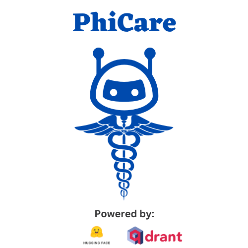
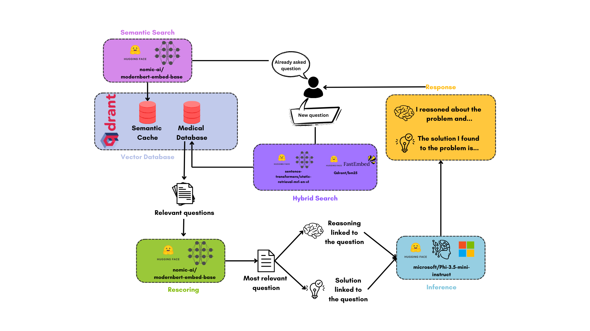

<h1 align="center">PhiCare</h1>
<h2 align="center">An assistant for your medical cases</h2>
<div align="center">
    
</div>

**PhiCare** is an assistant aimed at resolving medical cases. It is based on **Phi-3.5** by Microsoft, provided by [HuggingFace](https://huggingface.co) Inference API, and has a vast knowledge base (almost 25000 data points) managed via [Qdrant](https://qdrant.tech).

## Workflow



## How PhiCare works

PhiCare operates through three main components:

- **Front-end**: Utilizes Vite to render a ChatGPT-like web interface.
- **Back-end**: Employs a Python-based websocket to process messages from the front-end and send responses.
- **Database**: Uses a vector database built on [Qdrant](https://qdrant.tech) to store data for retrieval-augmented generation and semantic caching.

Once you launch the application, the vector database will ingest approximately 13,000 medical questions. Each question is associated with:
- The question itself
- o1-generated reasoning about the question
- o1-generated response
- The ground truth answer

The data comes from two HuggingFace datasets: [`medical-o1-reasoning-SFT`](https://huggingface.co/datasets/FreedomIntelligence/medical-o1-reasoning-SFT) and [`medical-o1-verifiable-problem`](https://huggingface.co/datasets/FreedomIntelligence/medical-o1-verifiable-problem). Dense embeddings are obtained using the static text encoder [`tomaarsen/static-retrieval-mrl-en-v1`](https://huggingface.co/tomaarsen/static-retrieval-mrl-en-v1), while sparse embeddings are generated with [`Qdrant/bm25`](https://huggingface.co/Qdrant/bm25). To speed up retrieval, the medical vector database leverages [binary quantization](https://qdrant.tech/articles/binary-quantization/).

When a user asks a medical question:
1. The backend first checks for similar questions in the semantic cache using [`modernbert-embed-base`](https://huggingface.co/nomic-ai/modernbert-embed-base). If a match is found, the corresponding answer is returned.
2. If no significant match is found, it prompts [`Phi-3.5-mini-instruct`](https://huggingface.co/microsoft/Phi-3.5-mini-instruct) (served on HuggingFace Inference API) to produce a question for searching the medical vector database.
3. The optimized question prompts a hybrid search within the medical vector database. The top 5 ranking matches for both sparse and dense vectors are retrieved and re-scored by `modernbert-embed-base`.
4. The top-ranking retrieved match (after re-scoring) is retained, and o1-generated reasoning, o1-generated response, and the ground truth answer are extracted from its payload.
5. `Phi-3.5-mini-instruct` is prompted to produce an answer based on the reasoning and o1-generated response, generating a first response.
6. The final, refined response is generated by `Phi-3.5-mini-instruct` starting from the ground truth answer.
7. The final response is always accompanied by a disclaimer stating that PhiCare is an AI assistant and not comparable to the care, accuracy, and knowledge of a human medical professional.

> [!NOTE]
> `Phi-3.5-mini-instruct` is instructed to assess if the reasoning and the answer provided are valid, relevant to the user's question, and correct. It is also instructed to output an "I don't know" answer when the question is ambiguous and the solution is not completely clear.


## Installation and usage

### 1. Docker

> _Required: [Docker](https://docs.docker.com/desktop/) and [docker compose](https://docs.docker.com/compose/)_

- Clone this repository

```bash
git clone https://github.com/AstraBert/phicare.git
cd phicare/docker-workflow/
```

- Add the `hf_token` secret in the [`.env.example`](./docker/.env.example) file and modify the name of the file to `.env`. You can get your HuggingFace token by [registering](https://huggingface.co/join) to HuggingFace and creating a [fine-grained token](https://huggingface.co/settings/tokens) that has access to the Inference API.

```bash
# modify your access token, e.g. hf_token="hf_abcdefg1234567"
mv .env.example .env
```

- Launch the docker application:

```bash
# If you are on Linux/macOS
bash start_services.sh
# If you are on Windows
.\start_services.ps1
```

You will see the application running on http://localhost:8501 and you will be able to use it successfully only after the backend is set up (you can see it from the logs). Depending on your connection and on your hardware, this might take some time (up to 30 mins to set up).

## Local

> _Required: [Docker](https://docs.docker.com/desktop/), [docker compose](https://docs.docker.com/compose/) and [conda](https://anaconda.org/anaconda/conda)_

- Clone this repository

```bash
git clone https://github.com/AstraBert/PhiCare.git
cd PhiCare/local
```

- If you are on macOS/Linux, you can run:

```bash
bash local_setup.sh
```

- If you are on Windows, running all the commands separately might be optimal:

```bash
# Launch Qdrant
docker compose up -d

# Create conda environment for the backend
conda env create -f ./backend/environment.yml
conda activate phicare-backend

# Ingest data
python3 data/toDatabase.py

# Create a semantic cache
python3 data/createCache.py

conda deactivate

# Install necessary dependencies for the UI
cd chatbot-ui/
npm install

# Back to the local folder
cd ..
```

- Once you are done with the set-up, launch the UI:

```bash
cd chatbot-ui/
npm run dev
```

- And, on a separate terminal window, launch the backend:

```bash
conda activate phicare-backend
cd backend/
python3 backend.py
```

Head over to http://localhost:8501 and you should see PhiCare up and running in less than one minute!

## Contributions

Contributions are more than welcome! See [contribution guidelines](./CONTRIBUTING.md) for more information :)

## Funding

If you found this project useful, please consider to [fund it](https://github.com/sponsors/AstraBert) and make it grow: let's support open-source together!😊

## License and usage guidelines

The software is hereby provided under an MIT-like license for what concern its distribution.

Furthermore, the [license](./LICENSE) includes also the terms of usage, that we report here:

```
1. The above copyright notice and this permission notice shall be included in all
copies or substantial portions of the Software.

2. The software is provided for scientific purposes only, including:
- Research
- Teaching 
- Scientific training
- Testing by developers 
It should not be used out of this sphere, and the authors of the software 
are not liable for any out-of-scope use or misuse of the software itself. 

3. THE SOFTWARE IS PROVIDED "AS IS", WITHOUT WARRANTY OF ANY KIND, EXPRESS OR
IMPLIED, INCLUDING BUT NOT LIMITED TO THE WARRANTIES OF MERCHANTABILITY,
FITNESS FOR A PARTICULAR PURPOSE AND NONINFRINGEMENT. IN NO EVENT SHALL THE
AUTHORS OR COPYRIGHT HOLDERS BE LIABLE FOR ANY CLAIM, DAMAGES OR OTHER
LIABILITY, WHETHER IN AN ACTION OF CONTRACT, TORT OR OTHERWISE, ARISING FROM,
OUT OF OR IN CONNECTION WITH THE SOFTWARE OR THE USE OR OTHER DEALINGS IN THE
SOFTWARE.
```

**By using PhiCare, you accept these terms of usage**: please, do not apply PhiCare to any out-of-scope use case.